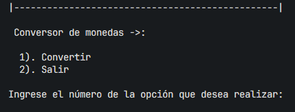
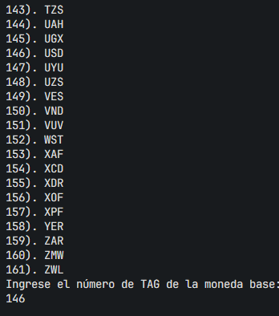
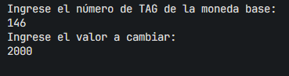
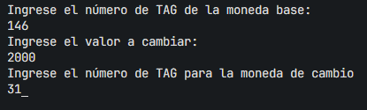
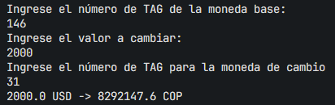

# Conversor de Monedas
Este es un programa de consola simple que te permite convertir entre diferentes monedas utilizando ExchangeRate-API.com.

## Funcionalidades
### Convertir:
Permite al usuario seleccionar una moneda base, ingresar un valor a convertir y elegir una moneda de destino para obtener el resultado de la conversión.

### Salir:
Termina la ejecución del programa.

## Requisitos
Java 11 o superior.
Acceso a Internet para consultar las tasas de cambio en tiempo real.

## Instrucciones de Uso

Ejecución del Programa

Descarga el código fuente o clona este repositorio.

Abre una terminal o línea de comandos en la carpeta donde se encuentra el archivo .jar o el archivo compilado.

Ejecuta el programa.

Al iniciar el programa, se mostrará un menú principal con las siguientes opciones:

Si seleccionas 1, se mostrará una lista numerada de monedas disponibles para elegir la moneda base.

Ingresa el número correspondiente al TAG de la moneda base que deseas convertir.

Luego, se te pedirá que ingreses el valor a convertir en formato decimal

 

Finalmente, ingresa el número correspondiente al TAG de la moneda a la que deseas convertir.

Resultado de la Conversión.

Una vez ingresados todos los datos necesarios, el programa realizará una solicitud a la API de ExchangeRate-API.com para obtener la tasa de cambio actualizada y mostrará el resultado de la conversión.

Para salir en cualquier momento, selecciona 2 en el menú principal.

